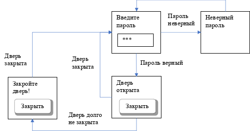

# Проект камеры хранения

## Задача

Реализовать модель системы автоматической камеры хранения. Камера хранения представляет собой шкаф с дверцей, оснащенной электрическим замком. Также камера хранения имеет графический интерфейс, позволяющий ввести пароль. При совпадении пароля с сохраненным в системе дверь камеры хранения автоматически открывается. При закрытии двери замок закрывается, и система переходит в исходное состояние – ожидание ввода пароля. Если дверь не будет закрыта в течение заданного промежутка времени, в графическом интерфейсе должно быть выведено предупреждение. После закрытия двери предупреждение отключается, система переходит в исходное состояние.

## Требования

- Модель камеры хранения должна быть реализована по клиент-серверной схеме бэкенд + фронтенд, взаимодействующих между собой через API. 

- Бэкенд представляет собой консольное приложение, написанное на языке Python.

- Бэкенд полностью реализует бизнес-логику камеры хранения. Для реализации логики необходимо использовать конечный автомат, реализованный средствами библиотеки transitions (https://github.com/pytransitions/transitions).

- Принять, что после перехода системы в состояние «замок открыт» дверь камеры хранения открыта. Сигнал закрытия двери имитировать нажатием кнопки «Закрыть дверь» в графическом интерфейсе.

- Состояние открытой двери моделировать в отдельном потоке. В момент перехода замка двери в открытое состояние создавать поток, который «хранит» информацию об открытой двери и мониторит факт закрытия двери. После получения сигнала закрытия двери поток разрушается.

- Фронтенд представляет собой web приложение, реализованное на библиотеке React.

- Фронтенд выполняет функцию графического интерфейса системы. Он не реализует бизнес-логику, а только отображает состояние системы и предоставляет средства для взаимодействия с ней.

- Реализация API на усмотрение разработчика.

- 

## Дополнительное задание

Покрыть бэкенд unit-тестами